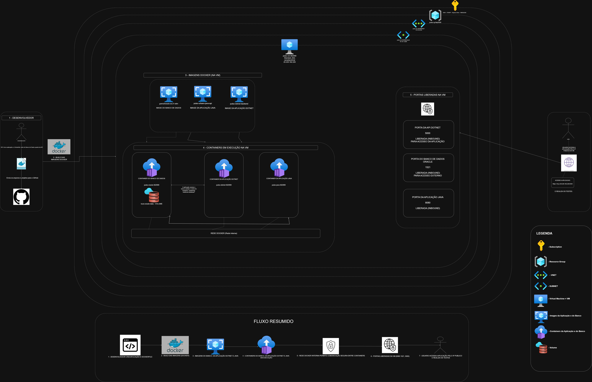

# Pulso Urbano — Infraestrutura DevOps

> Global Solution 2026/1 · FIAP · 2TDSPF

## Equipe

| Nome | RM |
|------|----|
| Felipe Ferrete | 562999 |
| Clayton | [RM] |
| Guilherme Sola | [RM] |
| Gustavo Bosak | [RM] |
| Brisola | [RM] |

## Links

| Recurso | URL |
|---------|-----|
| Java API (deploy) | http://20.12.204.186:8080/swagger-ui.html |
| .NET API (deploy) | http://20.12.204.186:5000/swagger/index.html |
| Vídeo DevOps (YouTube) | [PREENCHER após gravar] |
| Repositório Java | https://github.com/Pulso-Urbano-Global-Solutions-2026/backend-java |
| Repositório .NET | https://github.com/Pulso-Urbano-Global-Solutions-2026/backend-dotnet |

## Sobre a solução

O Pulso Urbano transforma dados orbitais do satélite Sentinel-5P (NO₂) e ECOSTRESS
(temperatura de superfície) em score de saúde ambiental para cidadãos de São Paulo.
Esta infra containeriza os dois backends em Oracle XE + Java API + .NET API,
todos orquestrados via Docker Compose em VM cloud Azure.

## Arquitetura Macro



| Container | Imagem | Porta | Papel |
|-----------|--------|-------|-------|
| `pulso-oracle-562999` | gvenzl/oracle-xe:21-slim | 1521 | Banco de dados |
| `pulso-java-562999` | build local (Spring Boot 3.2) | 8080 | API principal |
| `pulso-dotnet-562999` | build local (ASP.NET Core 10) | 5000 | API de alertas |

Rede: `pulso-net` (bridge) · Volume: `pulso-oracle-data` (named)

---

## Deploy em VM Cloud (Azure) — How-to completo

> **Pré-requisito:** Azure for Students ativo. Todo o processo roda no Azure Cloud Shell — nenhuma instalação local necessária.

### Passo 1 — Preparar o .env

Crie o `.env` localmente a partir do template:

```
ORACLE_PASSWORD=PulsoFiap@2026
ORACLE_APP_USER=RM562999
ORACLE_APP_PASSWORD=fiap2026
JWT_SECRET=<gerar com: openssl rand -base64 64>
DB_USER=RM562999
DB_PASS=fiap2026
COPERNICUS_USER=
COPERNICUS_PASS=
NASA_EARTHDATA_TOKEN=
CORS_ALLOWED_ORIGINS=*
ASPNETCORE_ENVIRONMENT=Development
DOTNET_DB_USER=RM562999
DOTNET_DB_PASS=fiap2026
DOTNET_JWT_SECRET=<mesmo valor do JWT_SECRET>
```

### Passo 2 — Abrir Azure Cloud Shell e fazer upload do .env

1. Acesse **portal.azure.com**
2. Clique no ícone `>_` (Cloud Shell) → selecione **Bash**
3. Clique em **Upload** e envie o arquivo `.env`

### Passo 3 — Baixar e rodar o script de deploy

```bash
# Baixar o script (sem precisar clonar o repo)
curl -fsSL https://raw.githubusercontent.com/Pulso-Urbano-Global-Solutions-2026/devops/main/scripts/deploy-azure.sh -o deploy-azure.sh

# Rodar — provisiona tudo automaticamente (~15 min)
bash deploy-azure.sh
```

O script cria VM, instala Docker, clona o repo com submodulos, injeta o `.env` e sobe os containers em background.

### O que o script faz

```
[1/8] Resource Group  pulso-rg-fiap2026
[2/8] VM              pulso-vm-562999  (Standard_D2s_v3 · 2 vCPU · 8 GB · Ubuntu 22.04)
[3/8] Portas          22, 8080, 5000, 1521
[4/8] Docker Engine   via apt repository oficial
[5/8] Usuário         pulso-app (não-root no host)
[6/8] Clone + .env    --recurse-submodules + injeção segura
[7/8] Containers      docker compose up --build -d
[8/8] Health check    30×30s — verifica Java API e .NET externamente
```

### Passo 4 — Verificar os containers (após deploy)

```bash
# SSH na VM (IP exibido no final do script)
ssh pulso-admin@<IP_DA_VM>

cd /opt/pulso-urbano

# Status dos 3 containers
docker compose ps

# Logs
docker logs pulso-oracle-562999 --tail=20
docker logs pulso-java-562999   --tail=20
docker logs pulso-dotnet-562999 --tail=20
```

### Passo 5 — Verificar usuário não-root

```bash
docker container exec pulso-java-562999   whoami  # → pulso
docker container exec pulso-dotnet-562999 whoami  # → pulso
docker container exec pulso-java-562999   pwd     # → /app
docker container exec pulso-java-562999   ls -l /app
```

### Passo 6 — Evidência do banco (SELECT obrigatório)

```bash
bash scripts/evidencia-banco.sh
```

Ou manualmente:

```bash
docker container exec -it pulso-oracle-562999 \
  sqlplus RM562999/fiap2026@//localhost:1521/XEPDB1

-- Dentro do SQL*Plus:
SELECT table_name FROM user_tables ORDER BY table_name;
SELECT COUNT(*) FROM usuario;
EXIT;
```

### Passo 7 — Testar endpoints com IP público

```bash
# Health checks
curl http://<IP_DA_VM>:8080/actuator/health
curl http://<IP_DA_VM>:5000/swagger/index.html | head -5

# Swagger (abrir no browser é mais visual para o vídeo)
# Java:  http://<IP_DA_VM>:8080/swagger-ui.html
# .NET:  http://<IP_DA_VM>:5000/swagger/index.html
```

### Cleanup pós-avaliação

```bash
az group delete --name pulso-rg-fiap2026 --yes --no-wait
```

---

## Estrutura do Repositório

```
devops/
├── java-api/               ← submodulo (Spring Boot 3.2)
├── dotnet-api/             ← submodulo (ASP.NET Core 10)
├── docs/
│   ├── arquitetura-macro.drawio
│   └── arquitetura-macro.png
├── scripts/
│   ├── deploy-azure.sh     ← provisionamento completo no Azure
│   └── evidencia-banco.sh  ← coleta de evidências para o vídeo
├── docker-compose.yml
├── .env.example
└── README.md
```

## Variáveis de Ambiente

| Variável | Descrição |
|----------|-----------|
| `ORACLE_PASSWORD` | Senha do SYS do Oracle |
| `ORACLE_APP_USER` | Usuário da aplicação (`RM562999`) |
| `ORACLE_APP_PASSWORD` | Senha do usuário da aplicação |
| `JWT_SECRET` | Segredo JWT — gerar com `openssl rand -base64 64` |
| `DOTNET_JWT_SECRET` | Mesmo valor do `JWT_SECRET` |
| `COPERNICUS_USER` | Email ESA Copernicus (pode ficar vazio no demo) |
| `COPERNICUS_PASS` | Senha ESA Copernicus |
| `NASA_EARTHDATA_TOKEN` | Token NASA Earthdata |
