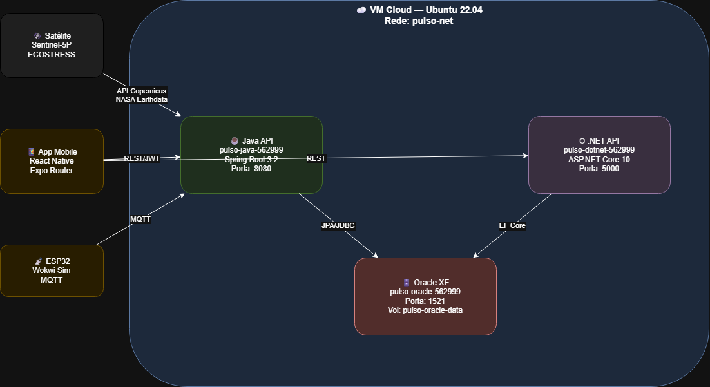

# Pulso Urbano — Infraestrutura DevOps

> Global Solution 2026/1 · FIAP · Turmas de Fevereiro · 2TDSPF

## Equipe

| Nome | RM |
|------|----|
| Felipe Ferrete | 562999 |
| Clayton | [RM] |
| Guilherme Sola | [RM] |
| Gustavo Bosak | [RM] |
| Brisola | [RM] |

## Links

| Recurso | URL |
|---------|-----|
| Java API (deploy) | [PREENCHER após deploy] |
| .NET API (deploy) | [PREENCHER após deploy] |
| Vídeo DevOps (YouTube) | [PREENCHER após gravar] |
| Repositório Java | https://github.com/Pulso-Urbano-Global-Solutions-2026/backend-java |
| Repositório .NET | https://github.com/Pulso-Urbano-Global-Solutions-2026/backend-dotnet |

## Sobre a solução

O Pulso Urbano transforma dados orbitais do satélite Sentinel-5P (NO₂) e ECOSTRESS
(temperatura de superfície) em score de saúde ambiental para cidadãos de São Paulo.
Esta infra containeriza os dois backends em Oracle + Java API + .NET API,
todos orquestrados via Docker Compose em VM cloud.

## Arquitetura Macro



| Container | Imagem | Porta | Papel |
|-----------|--------|-------|-------|
| `pulso-oracle-562999` | gvenzl/oracle-xe:21-slim | 1521 | Banco de dados |
| `pulso-java-562999` | build local (Spring Boot 3.2) | 8080 | API principal |
| `pulso-dotnet-562999` | build local (ASP.NET Core 10) | 5000 | API de alertas |

Rede: `pulso-net` (bridge) · Volume: `pulso-oracle-data` (named)

## Como rodar (How-to completo)

### Pré-requisitos
- Docker 24+ e Docker Compose v2
- Git com suporte a submodulos
- VM cloud com Ubuntu 22.04 (Oracle Cloud Free Tier recomendado)

### Passo 1 — Clonar com submodulos
```bash
git clone --recurse-submodules https://github.com/Pulso-Urbano-Global-Solutions-2026/devops.git
cd devops
```

### Passo 2 — Configurar variáveis de ambiente
```bash
cp .env.example .env
# Edite o .env com suas credenciais:
nano .env
# Preencha obrigatoriamente: JWT_SECRET, COPERNICUS_USER, COPERNICUS_PASS
```

### Passo 3 — Subir todos os containers
```bash
# Build + start em modo background (segundo plano)
docker compose up -d --build

# Verificar se os 3 containers estão rodando
docker compose ps
```

### Passo 4 — Verificar logs
```bash
# Logs do Oracle (aguardar "DATABASE IS READY TO USE")
docker logs pulso-oracle-562999 --tail=30

# Logs da Java API
docker logs pulso-java-562999 --tail=30

# Logs da .NET API
docker logs pulso-dotnet-562999 --tail=30
```

### Passo 5 — Acessar containers e verificar usuário + estrutura
```bash
# Java API — verificar usuário e diretório
docker container exec pulso-java-562999 whoami
docker container exec pulso-java-562999 pwd
docker container exec pulso-java-562999 ls -l /app

# .NET API
docker container exec pulso-dotnet-562999 whoami
docker container exec pulso-dotnet-562999 ls -l /app

# Oracle
docker container exec pulso-oracle-562999 whoami
```

### Passo 6 — Evidenciar persistência com SELECT no banco
```bash
# Conectar direto no container do banco e executar SELECT
docker container exec -it pulso-oracle-562999 sqlplus RM562999/fiap2026@//localhost:1521/XEPDB1

-- Dentro do SQL*Plus:
SELECT table_name FROM user_tables ORDER BY table_name;
SELECT COUNT(*) FROM usuario;
SELECT COUNT(*) FROM zona_cidade;
SELECT COUNT(*) FROM score_diario;
EXIT;
```

### Passo 7 — Testar os endpoints
```bash
# Java API — health check
curl http://IP_DA_VM:8080/actuator/health

# Java API — score atual
curl http://IP_DA_VM:8080/api/v1/score/current?lat=-23.5505\&lon=-46.6333

# .NET API — health check
curl http://IP_DA_VM:5000/api/health

# .NET API — alertas
curl http://IP_DA_VM:5000/api/alertas
```

### Passo 8 — Script automatizado de evidências (para o vídeo)
```bash
# Roda todos os checks de uma vez
bash scripts/evidencia-banco.sh
```

## Estrutura do Repositório

```
devops/
├── java-api/          ← submodulo (Spring Boot 3.2 — backend-java)
├── dotnet-api/        ← submodulo (ASP.NET Core 10 — backend-dotnet)
├── docs/
│   ├── arquitetura-macro.drawio
│   └── arquitetura-macro.png
├── scripts/
│   ├── setup-vm.sh       ← setup completo da VM cloud
│   └── evidencia-banco.sh ← coleta de evidências para o vídeo
├── docker-compose.yml
├── .env.example
└── README.md
```

## Variáveis de Ambiente

| Variável | Descrição | Obrigatória |
|----------|-----------|-------------|
| `ORACLE_PASSWORD` | Senha do SYS do Oracle | ✅ |
| `ORACLE_APP_USER` | Usuário da aplicação no Oracle | ✅ |
| `ORACLE_APP_PASSWORD` | Senha do usuário da aplicação | ✅ |
| `JWT_SECRET` | Segredo JWT compartilhado (min 64 chars) | ✅ |
| `COPERNICUS_USER` | Email da conta ESA Copernicus | ✅ |
| `COPERNICUS_PASS` | Senha da conta ESA Copernicus | ✅ |
| `NASA_EARTHDATA_TOKEN` | Token NASA Earthdata | ✅ |
| `DOTNET_JWT_SECRET` | Segredo JWT para a .NET API | ✅ |

> Gere o JWT_SECRET com: `openssl rand -base64 64`
